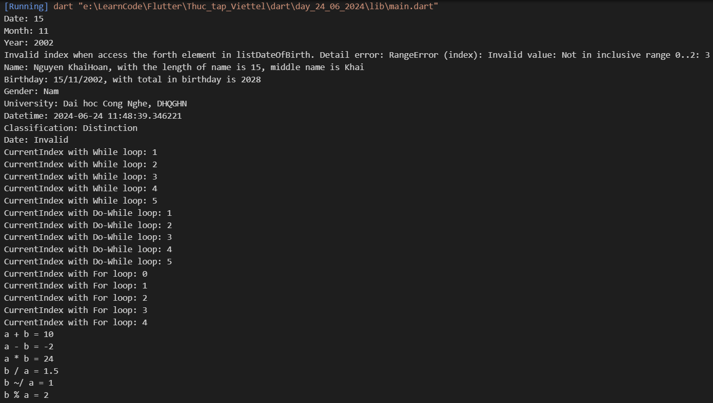

# day_24_06_2024

Thực tập Viettel ngày 24/6/2024

## Kết quả đạt được

- Đã tìm hiểu về Dart
- Tìm hiểu và thực hành Biến (String, int, double, bool), List/Iterable, Try-Catch, Luồng điều khiển (if-else, switch-case, while, do-while, for), Toán tử ba ngôi, const/final, Các toán tử (+, -, *, /)

